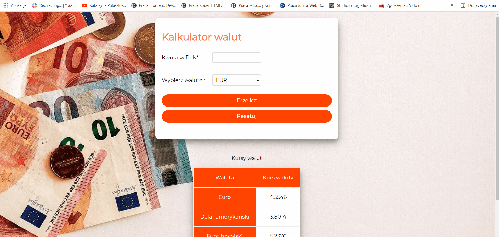

# Currency converter

## Demo 
https://szymonuscinski27.github.io/currency-converter/

## Description

It's a simply currency converter that allow you convert currency from Polish zloty to Euro, United States dollar or British pound.
You just need to write an amount in input and choose currency that you interested.

## How to use it?

## Technologies
- HTML
- CSS
- JavaScript (ES6+)

## Methodology
- BEM

### Author
Szymon Uscinski

You can contact me at szymonuscinski@gmail.com
